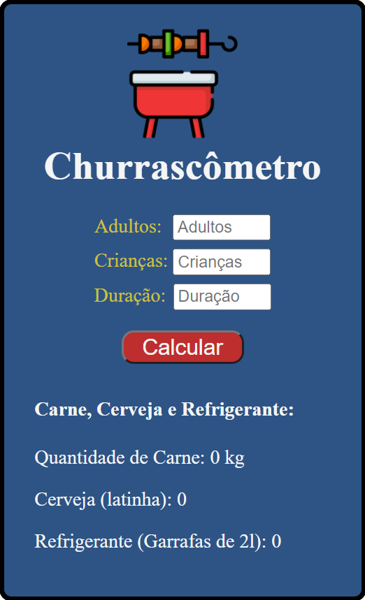

# Churrascômetro :meat_on_bone:

---

## Criação de um site que calcula a quantidade necessária de Carne, Cerveja e Refrigerante para um churrasco.

---

### Foi levado em consideração para o cálculo:

  
 

- 400g de carne por pessoa;
- 1200ml de cerveja por pessoa;
- 1000ml de refrigerante por pessoa.

#### Após 6 horas de churrasco, os valores mudam para:

- 650g de carne por pessoa;
- 2000ml de cerveja por pessoa;
- 1500ml de refrigerente por pessoa.

#### Detalhes adicionais:

- 1 lata de cerveja = 355 ml;
- Crianças consomem a metade de um adulto.

